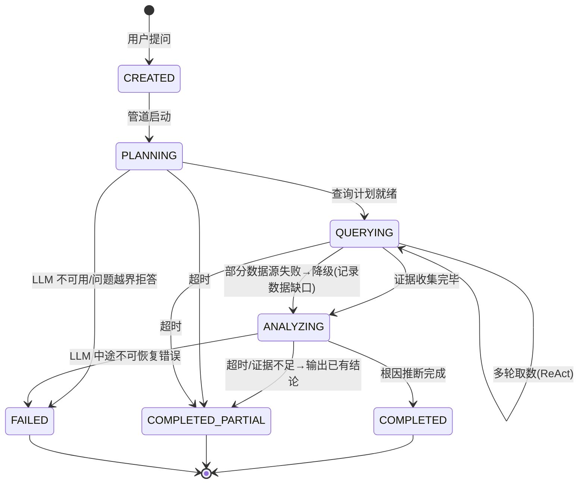

# 领域模型 — Epiphaneia

> 版本：v1.0-draft | 日期：2026-07-18
> 上游：`PRD.md` v1.0、`userFlow.md` v1.0-draft、`architectureDesignHandoff.md`
> 方法论：DDD — 限界上下文 / 聚合根 / 实体 / 值对象 / 领域事件 / 领域服务

---

## 1. 限界上下文总览

```
┌─────────────────────────────────────────────────────────────┐
│                        Epiphaneia                           │
│                                                             │
│  ┌──────────┐  ┌──────────┐  ┌──────────┐  ┌──────────┐   │
│  │ 诊断      │  │ 应用管理  │  │ 集成      │  │ 身份      │   │
│  │ Diagnosis│  │ App Mgmt │  │Integration│  │ Identity │   │
│  │          │  │          │  │          │  │          │   │
│  │Conversation│ │Application│ │DataSource│  │ Admin    │   │
│  │ Message   │  │ (聚合根)  │  │ (聚合根)  │  │ (聚合根)  │   │
│  │ (聚合根)  │  │          │  │          │  │          │   │
│  └────┬─────┘  └────┬─────┘  └────┬─────┘  └────┬─────┘   │
│       │             │             │             │          │
│  ┌────┴─────────────┴─────────────┴─────────────┴────┐     │
│  │               共享内核 (Shared Kernel)              │     │
│  │  DiagnosisState, Evidence, RiskAssessment,        │     │
│  │  RootCauseHypothesis, FixSuggestion               │     │
│  └───────────────────────────────────────────────────┘     │
│                                                             │
│  ┌──────────────────────────────────────────────────┐      │
│  │         领域服务 (Domain Services)                 │      │
│  │  DiagnosisOrchestrator, ReportSynthesizer,        │      │
│  │  ConnectorRegistry                                │      │
│  └──────────────────────────────────────────────────┘      │
└─────────────────────────────────────────────────────────────┘
```

四个限界上下文 + 共享内核。MVP 单 Skill（Ops Skill），Skill 是集成上下文中 Connector 的同级抽象——仅定义接口，当前无独立上下文。

---

## 2. 诊断上下文 (Diagnosis Context) — 核心

### 2.1 Conversation（聚合根）

一次应用诊断的**连续会话**。是对话上下文 + LLM 记忆的容器。报告是该聚合的只读视图，非独立实体。

| 属性 | 类型 | 说明 |
|------|------|------|
| `id` | ConversationId (VO) | UUID |
| `applicationId` | ApplicationId (VO) | 所属应用（多应用隔离） |
| `title` | String | 首条用户问题的截断（≤80 字符），用于历史列表 |
| `messages` | List\<Message\> | 消息序列（有序）。聚合内部管理，外部不可直接追加 |
| `createdAt` | Instant | |
| `updatedAt` | Instant | 最后一条消息时间 |

**不变量：**
- 一个应用可有多个 Conversation，同一时刻只有一个"活跃"（对 UI 而言；DB 层面允许多个，用户可回看历史并继续提问）
- 清空 = 硬删除整个聚合，无回收站
- Conversation 自身无"完成/关闭"状态——始终可追问，除非被清空

**行为：**
- `askQuestion(question: String): Message` — 用户提问，创建 USER 消息 + 初始化 AGENT 消息（CREATED），触发诊断流程
- `clear()` — 清空全部消息（实际为删除聚合）
- `synthesizeReport(): String` — 委托 ReportSynthesizer，基于全部 messages 合成 Markdown（领域服务调用，聚合本身不持有 LLM 引用）

### 2.2 Message（实体，在 Conversation 聚合内）

| 属性 | 类型 | 说明 |
|------|------|------|
| `id` | MessageId (VO) | UUID，聚合内唯一 |
| `role` | MessageRole (enum) | `USER` \| `AGENT` |
| `content` | String | USER: 问题原文；AGENT: 最终回答全文 |
| `diagnosisState` | DiagnosisState? (VO) | 仅 AGENT 消息有值；追踪当前诊断运行的状态机 |
| `evidence` | List\<Evidence\> (VO) | 本轮采集的证据（跨数据源） |
| `hypotheses` | List\<RootCauseHypothesis\> (VO) | LLM 输出的根因假设，最多 3 个，按 confidence 降序 |
| `suggestions` | List\<FixSuggestion\> (VO) | 修复建议 |
| `riskAssessment` | RiskAssessment? (VO) | 风险评估 |
| `tokenCount` | Int? | LLM 消耗 token 数（成本追踪，仅在 COMPLETED/COMPLETED_PARTIAL 后填入） |
| `createdAt` | Instant | |
| `completedAt` | Instant? | 诊断运行结束时间（终态时填入） |

**状态机**（来自 `userFlow.md` §3，Message 级别复现）：



设计要点：
- **无 CANCELLED 状态**——服务端总是跑到终态（handoff 决策）
- **诊断失败 != 聚合失效**——FAILED 后用户可在同一 Conversation 中重新提问（创建新的 AGENT 消息），历史 FAILED 消息保留
- COMPLETED_PARTIAL 在报告中声明数据缺口（对应 FR-2/3 降级场景）

### 2.3 值对象（共享内核）

**DiagnosisState**（enum）：`CREATED | PLANNING | QUERYING | ANALYZING | COMPLETED | COMPLETED_PARTIAL | FAILED`

**Evidence**：
| 字段 | 类型 | 说明 |
|------|------|------|
| `source` | DataSourceType (enum) | `PROMETHEUS` \| `ELASTICSEARCH` \| `ACTUATOR` |
| `query` | String | 实际执行的查询语句（PromQL / ES DSL / Actuator endpoint） |
| `summary` | String | LLM 对查询结果的摘要（原始数据不存——不采集是定位之本） |
| `anomalyWindow` | TimeRange? | 检测到的异常区间 |
| `collectedAt` | Instant | |

设计要点：Evidence 存储的是"查询语句 + 摘要"，不存原始数据——Epiphaneia 不做数据采集，证据摘录足够支撑报告。

**RootCauseHypothesis**：
| 字段 | 类型 | 说明 |
|------|------|------|
| `rank` | Int | 1-3，按置信度降序 |
| `description` | String | 根因假设描述 |
| `confidence` | Double | 0.0-1.0（LLM 自行评估，非统计量——在报告中附免责声明） |
| `supportingEvidence` | List\<Evidence\> | 支撑该假设的证据子集（引用，非复制） |

**FixSuggestion**：
| 字段 | 类型 | 说明 |
|------|------|------|
| `description` | String | 修复步骤说明 |
| `complexity` | enum | `LOW` \| `MEDIUM` \| `HIGH`——MVP 一律标为 `HUMAN_REVIEW_REQUIRED`（非可执行指令，仅建议） |
| `isSafe` | Boolean | 是否可在无人监督下执行——MVP 一律 `false` |

**RiskAssessment**：
| 字段 | 类型 | 说明 |
|------|------|------|
| `level` | enum | `LOW` \| `MEDIUM` \| `HIGH` \| `CRITICAL` |
| `impact` | String | 如果不修复，影响描述 |
| `urgency` | String | 建议修复时限 |

---

## 3. 应用管理上下文 (Application Management Context)

### 3.1 Application（聚合根）

用户管理的被监控应用。单用户多应用（PRD FR-6）。与 Conversation 是一对多关系。

| 属性 | 类型 | 说明 |
|------|------|------|
| `id` | ApplicationId (VO) | UUID |
| `name` | String | 用户自定义名称（如 "user-service"） |
| `actuatorUrl` | String? | Spring Boot Actuator 基地址（如 `http://user-svc:8080/actuator`），通用应用可为空 |
| `prometheusLabel` | String | 在 Prometheus 中对应的 service label 值（用于自动拼接 PromQL 过滤） |
| `tags` | List\<String\> | 可选标签（如 `prod` `staging`） |
| `actuatorInfo` | ActuatorInfo? (VO) | Actuator 探测结果快照（最近一次探测） |
| `createdAt` | Instant | |

**行为：**
- `probeActuator(): ActuatorInfo` — 探测 Actuator 端点，更新快照
- `rename(name: String)` — 重命名
- `updateLabel(label: String)` — 更新 Prometheus label

**不变量：**
- 应用名不可空，但在 UI 上不强制唯一（用户自己区分）
- actuatorUrl 为空的应用降级为"通用应用"——仍可诊断（基于 Prometheus/ES），仅无应用级上下文
- 删除 Application 时级联删除其所有 Conversation

### 3.2 ActuatorInfo（值对象）

| 字段 | 类型 | 说明 |
|------|------|------|
| `healthStatus` | String? | UP / DOWN / UNKNOWN |
| `healthDetails` | String? | health 端点返回的详情摘要 |
| `metrics` | Map\<String, String\> | 关键指标快照（如 `jvm.memory.max` → "2048MB"） |
| `env` | Map\<String, String\> | 关键环境变量（脱敏后） |
| `info` | Map\<String, String\> | info 端点构建信息 |
| `probedAt` | Instant | 探测时间 |

---

## 4. 集成上下文 (Integration Context)

### 4.1 DataSource（聚合根）

数据源连接配置。Prometheus 和 Elasticsearch 各为一个独立 DataSource 聚合。**共享于所有应用**（MVP 单用户共用一套）。

| 属性 | 类型 | 说明 |
|------|------|------|
| `id` | DataSourceId (VO) | UUID |
| `type` | DataSourceType (enum) | `PROMETHEUS` \| `ELASTICSEARCH` |
| `name` | String | 显示名（如 "Production Prometheus"） |
| `url` | String | API 基地址 |
| `authConfig` | AuthConfig (VO) | 认证方式（Basic Auth / Bearer Token / None），凭证加密存储 |
| `isConnected` | Boolean | 最近一次连通测试结果 |
| `metadata` | Map\<String, String\> | 类型特定配置（如 ES index pattern） |
| `createdAt` | Instant | |

**行为：**
- `testConnection(): Boolean` — 连通测试
- `updateConfig(...)` — 更新配置（凭证变更时走加密存储）

### 4.2 Connector（领域服务接口，SPI）

**接口定义在领域层，实现放在基础设施层。** 这是社区贡献的核心扩展点。

```
interface Connector<T: QueryRequest, R: QueryResult> {
    fun query(request: T): R
    fun testConnection(): Boolean
}
```

MVP 两个实现：`PrometheusConnector`、`ElasticsearchConnector`。Loki / Jaeger 等走同一 SPI 由社区或 v1.0 补充。

### 4.3 LLMProvider（实体，随 DataSource 同属集成边界）

| 属性 | 类型 | 说明 |
|------|------|------|
| `id` | LLMProviderId (VO) | UUID |
| `provider` | LLMType (enum) | `OPENAI` \| `ANTHROPIC` \| `DEEPSEEK` \| `OLLAMA` \| `CUSTOM` |
| `modelName` | String | 如 `gpt-5` / `claude-opus-4-8` |
| `apiKey` | String | 加密存储 |
| `baseUrl` | String? | 自定义 endpoint（Ollama / 代理） |
| `isConnected` | Boolean | |

设计要点：LLMProvider 不持有领域逻辑——Agent 编排框架使用它但不属于同一聚合。它在集成边界是因为它是外部服务的配置代理。

---

## 5. 身份上下文 (Identity Context)

### 5.1 Admin（聚合根）

单管理员（PRD FR-10）。无多用户、无角色。

| 属性 | 类型 | 说明 |
|------|------|------|
| `id` | AdminId (VO) | 固定值（单实例） |
| `username` | String | 固定 `admin` |
| `passwordHash` | String | bcrypt |
| `mustChangePassword` | Boolean | 首次启动后为 true |
| `createdAt` | Instant | |

**行为：**
- `changePassword(current, new): void`
- `login(password): Boolean` — 委托 AuthenticationService

### 5.2 ApiToken（实体，在 Admin 聚合内）

| 属性 | 类型 | 说明 |
|------|------|------|
| `id` | TokenId (VO) | UUID |
| `name` | String | 用户自定义标签（如 "CI pipeline"） |
| `tokenHash` | String | SHA-256 |
| `prefix` | String | 明文前 8 位用于 UI 展示（如 "epi_ab12..."） |
| `createdAt` | Instant | |
| `revokedAt` | Instant? | 吊销时间 |

**行为：**
- `revoke(): void`
- `isValid(rawToken: String): Boolean`

**不变量：**
- Token 明文仅在生成时展示一次，不存储
- 已吊销 Token 不可恢复

---

## 6. 领域服务 (Domain Services)

### 6.1 DiagnosisOrchestrator

诊断管道核心编排。定义在领域层，Agent 框架（LangChain4j）实现于基础设施层。

```
interface DiagnosisOrchestrator {
    fun execute(conversation: Conversation, question: String): DiagnosisResult
}
```

编排流程（对应 userFlow 状态机）：
1. PLANNING — LLM 理解问题，规划查询计划
2. QUERYING — 通过 ConnectorRegistry 执行多轮取数（ReAct 循环）
3. ANALYZING — LLM 综合证据进行根因推断
4. COMPLETED / COMPLETED_PARTIAL / FAILED — 终态

领域层持有接口，不持有 LangChain4j——满足 handoff 1.6 "领域层不感知框架"约束。

### 6.2 ReportSynthesizer

报告实时合成。无状态——纯函数式领域服务。

```
interface ReportSynthesizer {
    fun synthesize(conversation: Conversation): String  // 返回 Markdown
}
```

输入 = 完整 Conversation（全部 Messages + Evidence + Hypotheses），输出 = 结构化 Markdown。不持久化——每次调用即合成。实现层使用 LLM 进行文本组织，但合成逻辑（证据整合、时间线生成）可部分用模板引擎降低 LLM 成本和延迟。

### 6.3 ConnectorRegistry

数据源连接器注册与发现。用于 DiagnosisOrchestrator 按需获取 connector。

```
interface ConnectorRegistry {
    fun getConnector(type: DataSourceType): Connector
    fun listAll(): List<Connector>
    fun validateAll(): Map<DataSourceType, Boolean>
}
```

---

## 7. 领域事件

| 事件 | 触发时机 | 消费者 |
|------|---------|--------|
| `ConversationCreated` | 新会话创建 | 历史列表刷新、SSE 通知 |
| `DiagnosisStarted` | Message 状态 → PLANNING | SSE `state` 事件推送 |
| `EvidenceCollected` | 每个数据源查询完毕 | SSE `step` 事件推送；前端更新过程面板 |
| `DiagnosisCompleted` | Message 状态 → COMPLETED | SSE `done` 事件推送；报告可合成标记 |
| `DiagnosisCompletedPartial` | Message 状态 → COMPLETED_PARTIAL | 同上，前端标注数据缺口 |
| `DiagnosisFailed` | Message 状态 → FAILED | SSE `error` 事件推送 |
| `ConversationCleared` | 会话清空 | 关联 Message 级联删除（基础设施层处理） |
| `ApplicationAdded` | 新应用注册 | 应用切换器更新 |
| `ApplicationInfoUpdated` | Actuator 探测完成 | 应用详情展示 |
| `ApplicationRemoved` | 应用删除 | 级联清理其 Conversation |
| `TokenGenerated` | API Token 创建 | 一次性展示明文 |
| `TokenRevoked` | API Token 吊销 | 缓存失效 |

---

## 8. 统一语言 (Ubiquitous Language)

| 术语 | 英文 | 含义 |
|------|------|------|
| 会话 | Conversation | 一次连续的应用诊断对话，包含多轮 Q&A |
| 消息 | Message | 会话中的一条提问或回答。AGENT 消息包含诊断状态 |
| 诊断运行 | Diagnosis Run | 单次提问 → 查询 → 分析 → 结论的完整流水线（= 一条 AGENT Message 从 CREATED 到终态的过程） |
| 证据 | Evidence | 从数据源获取的指标/日志摘录，不包含原始数据 |
| 根因假设 | Root Cause Hypothesis | LLM 推断的可能根因，按置信度排名 |
| 修复建议 | Fix Suggestion | 修复步骤建议，MVP 全部标记为需人类确认 |
| 风险评估 | Risk Assessment | 如果不修复的影响评估 |
| 报告 | Report | 会话级 Markdown 合成的只读视图，非持久实体 |
| 应用 | Application | 被监控的目标服务 |
| 数据源 | Data Source | Prometheus / Elasticsearch 等外部数据提供者 |
| 连接器 | Connector | 数据源的适配器，SPI 可插拔 |
| 管理员 | Admin | 单用户，唯一账号 |
| API 令牌 | API Token | 用于 REST API 认证的 Bearer Token |

---

## 9. 跨上下文交互

| 交互 | 描述 |
|------|------|
| 诊断 → 应用管理 | Conversation 通过 `applicationId` 引用 Application；Application 删除时级联清理 Conversation |
| 诊断 → 集成 | DiagnosisOrchestrator 通过 ConnectorRegistry 获取 DataSource 对应的 Connector 实现 |
| 诊断 → 集成（LLM） | DiagnosisOrchestrator 使用 LLMProvider 发送 prompt 并接收响应；领域层不持有 LLM 调用实现 |
| 身份 → 所有上下文 | API Token 验证在基础设施层统一拦截，不侵入领域；Admin 变更密码不影响其他聚合 |

---

## 10. 关键架构决策（来自 handoff，此处为领域模型映射）

| 决策 | 领域模型体现 |
|------|-------------|
| 报告不持久存储 | 无 Report 聚合/实体；ReportSynthesizer 为无状态领域服务 |
| 单用户多应用 | Application 聚合直接属于用户，无 Tenant 概念；Conversation.appId 而非 userId |
| Agent 层 Java 内嵌 + 领域层不感知框架 | DiagnosisOrchestrator 为领域接口，LangChain4j 实现在基础设施层 |
| 逻辑六层 | 当前四个限界上下文对应六层：①connector→集成 ②engine+③llm+④orchestration→诊断领域服务 ⑤skill→诊断上下文 ⑥api→接口层（非 DDD 模型范围） |
| 单应用配置→多应用列表 | Application 聚合自然支持多实例；Conversation 强关联 Application |
| "停止"无服务端取消 | DiagnosisState 无 CANCELLED 枚举值 |
| 清空 = 硬删除 | ConversationCleared 事件后聚合即被删除，无软删除/回收站 |

---

> 一致性检查清单（退出条件之一）：
> - [ ] Conversation 状态机 = userFlow.md §3 → ✅ 一致的 7 状态 + 迁移规则
> - [ ] 无 Report 聚合 = PRD FR-5 → ✅
> - [ ] Application 多应用 = PRD FR-6 → ✅
> - [ ] Admin 单用户 = PRD FR-10 → ✅
> - [ ] DiagnosisOrchestrator 接口 = handoff 1.6 约束 → ✅
> - [ ] Connector SPI = mvpScope 三大扩展点之一 → ✅
> - [ ] 统一语言覆盖全部 PRD 功能 → ✅
>
> 下一步：`apiDesign.md` 以此模型中的聚合根为单位设计 REST 资源。
