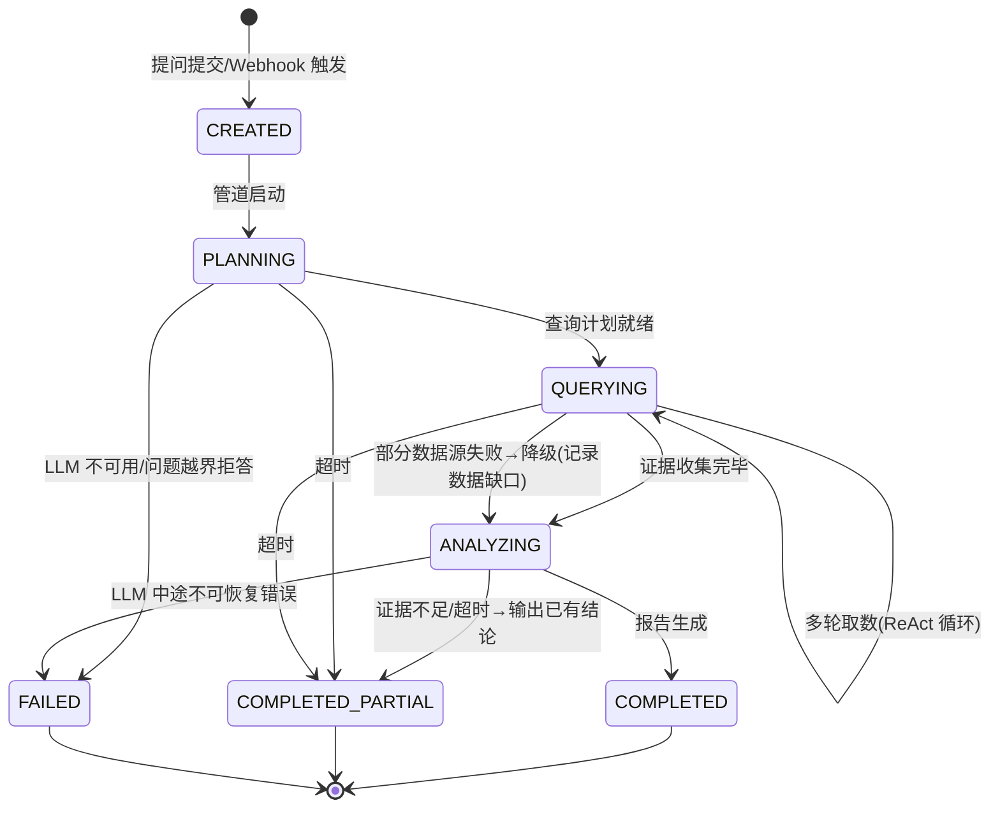

# 用户流程 — Epiphaneia MVP

> 版本：v1.0-draft | 日期：2026-07-18
> 上游：`PRD.md`（v1.0，已评审）
> 范围：v0.9 全部页面与路径 + v0.95 告警触发路径（因其 API 契约随 v0.9 定义）

---

## 1. 页面清单（信息架构）

| # | 页面 | 对应 FR | 说明 |
|---|------|---------|------|
| P1 | 登录页 | FR-10 | 单管理员会话登录 |
| P2 | 首启向导 | FR-10/12/2/3/6 | 仅首次启动出现，四步：改密码 → 配 LLM → 配数据源 → 添加首个应用 |
| P3 | 诊断工作台（主页面） | FR-1/6/11 | 对话式交互 + 顶部应用切换器 + 过程流式展示，产品核心 |
| P4 | 报告查看 | FR-5 | 会话级完整报告实时合成 + 导出下载 |
| P5 | 历史会话 | FR-1 | 会话列表 + 关键词过滤 + 清空操作（v1.0 知识库前的简版） |
| P6 | 设置页 | FR-2/3/6/10/12 | 四个分区：LLM 配置 / 数据源配置 / 目标应用管理（列表） / 安全（改密码、API Token 管理） |

导航结构：左侧栏（新诊断 / 历史 / 设置）+ 主区域。P1/P2 独立于导航壳。

---

## 2. 核心路径

### 流程 0：首次启动（Onboarding）

```
docker compose up -d
  → 控制台日志打印初始密码（仅此一次）
  → 浏览器打开 → P1 登录（admin + 初始密码）
  → 强制跳转 P2 向导：
     Step 1 修改密码（不可跳过）
     Step 2 配置 LLM（提供商/模型/Key/BaseURL，含连通测试；可跳过→后补）
     Step 3 配置 Prometheus + Elasticsearch 地址与凭证（含连通测试；可跳过）
     Step 4 （可选）添加目标应用（应用名 + Actuator 地址） → 自动探测 → 可再添加更多
  → 进入 P3，顶部默认选中刚添加的应用，输入框预填示例问题（如 "Why is my service slow in the last hour?"）
```

- 异常：Step 2/3 连通测试失败不阻塞前进（允许"先进去看看"），但 P3 顶部持续显示配置缺失横幅，点击直达设置页
- 边界：LLM 未配置时提交提问 → 立即失败并引导至设置，不进入诊断管道

### 流程 1：自然语言诊断（主路径）

```
应用切换器选择应用（如未选→引导选择或创建）
  → P3 输入问题 → 提交
  → 若该应用无活跃会话 → 自动创建新会话（首问题为标题）
  → SSE 通道建立
  → 过程区逐步展示（对应状态机 §3）：
     "Understanding your question…"          (PLANNING)
     "Querying Prometheus: <PromQL>…"        (QUERYING，每步展示实际查询语句)
     "Found anomaly window: 14:02–14:15…"    (QUERYING 中间发现)
     "Querying Elasticsearch: <关键词/时间窗>…"
     "Analyzing evidence…"                    (ANALYZING)
  → 结论流式输出（token 级）
  → 完成 → 内联展示本轮 agent 回复（含 mini 摘要）+ "查看完整报告"入口 (P4)
  → 继续追问 = 同会话内追加消息，上下文自动累积
```

- **应用切换 = 独立会话空间**：切换应用后 P3 展示该应用的当前活跃会话（若无则带空输入框）；A 应用会话中不可追问 B 应用的问题
- 用户中途"停止"：客户端关闭 SSE，**服务端继续跑完并存档消息**——用户可稍后在 P5 找到完整结果（简化决策：不做服务端取消，避免中断语义复杂度；upgrade path 见 handoff）
- SSE 断连：自动重连（拉取增量事件补齐）；重连失败提示刷新，已存内容不丢
- 超时（120s）：终止并输出已有证据 + "证据不足"声明

### 流程 2：报告查看与导出

```
P3 或 P5 → 点击"查看完整报告"(任一消息旁或会话工具栏)
  → LLM 读取完整会话上下文，当场合成结构化 Markdown 报告
  → P4 渲染（时间线/全部证据链/根因假设/修复建议/风险）
  → 操作：
     "复制 Markdown" → 剪贴板
     "导出下载" → 浏览器下载 .md 文件（文件名含应用名+时间）
     "返回会话" → 回 P3 继续追问
  → 用户继续追问 → 报告自然"过期"——下次点击重新合成（含新消息）
```

要点：
- **每查即实时合成**，不缓存、不存储——每次都是基于当前会话的当场快照
- **追问后报告自动更新**——这是正确行为，不是 bug
- **导出即下载**：服务器不留存导出文件；导出点区分由用户自己管理本地文件
- 追问：报告不是终点，P4 可回 P3 在同一会话上下文中继续问（"那这个慢查询在哪个表上？"）

### 流程 3：历史会话

```
P5：按时间倒序列出会话（所属应用 + 首问题为标题 + 状态徽标 + 时间）
  → 关键词过滤（标题/内容 LIKE 级，非全文索引——v1.0 FR-16 升级）
  → 点击 → 进入 P3 只读回放 或 P4 实时合成报告
  → 清空会话（🗑 操作）→ 见流程 6
```

### 流程 4：设置变更

```
P6 各分区独立保存 → 保存即生效（无需重启，FR-12）
  → 敏感字段（Key/密码）显示为掩码，仅可覆写不可回读
  → API Token 分区：生成（明文仅展示一次）/ 吊销列表
```

### 流程 5：清空会话

```
P5 会话条目 → 点击 🗑 → 确认弹窗（"将删除此会话的全部诊断消息和上下文，不可恢复。已导出的本地文件不受影响。"）
  → 确认 → 会话及全部消息硬删除
  → 若删除的是当前活跃会话 → P3 回到该应用的空白状态（或切到最近的另一会话）
```

- 无回收站/软删除——简化存储管理

### 流程 6：告警触发诊断（v0.95，契约先行）

```
AlertManager → POST /api/v1/webhooks/alertmanager (Bearer Token)
  → 按告警标签（service/severity/时间窗）自动构造诊断问题 → 进入流程 1 管道（无 UI 端）
  → 完成 → 飞书/钉钉推送摘要 + 报告链接（链接指向 P4，需登录）
```

- v0.9 行为：端点存在但返回 501 + 文档链接（契约已定，实现推迟）

---

## 3. 诊断会话状态机（核心，下游 domainModel/dbSchema 依据）



| 状态 | 用户可见语义 | 终态 |
|------|-------------|------|
| CREATED | 已接收 | 否 |
| PLANNING | 理解问题、规划查询 | 否 |
| QUERYING | 正在查询数据源（可多轮） | 否 |
| ANALYZING | 综合分析中 | 否 |
| COMPLETED | 完整报告 | ✅ |
| COMPLETED_PARTIAL | 部分结论（降级/超时/证据不足，报告中声明缺口） | ✅ |
| FAILED | 失败（原因可读） | ✅ |

设计要点：
- **无 CANCELLED 状态**——"停止"是客户端行为，服务端总是跑到终态（流程 1 简化决策）
- **降级不是失败**——单数据源不可达进 COMPLETED_PARTIAL 路径，报告声明数据缺口（FR-2/3 验收标准）
- 每次状态迁移即一条 SSE 事件，事件同时落库（断连重放依据）

---

## 4. SSE 事件类型（供 apiDesign 细化）

| 事件 | 载荷要点 |
|------|---------|
| `state` | 状态机迁移（新状态 + 时间戳） |
| `step` | 过程步骤（人类可读描述 + 结构化明细，如实际 PromQL） |
| `token` | 结论流式文本片段 |
| `done` | 终态 + conversation_id（报告以该会话上下文合成） |
| `error` | 错误码 + 可读消息 |

---

## 5. 全局异常路径

| 场景 | 行为 |
|------|------|
| 未认证访问任何页面/API | UI 重定向 P1；API 返回 401 |
| 会话过期（操作中） | 弹层重新登录，返回后不丢当前输入 |
| LLM 未配置 | P3 提交即拦截，引导 P6 |
| 数据源全部未配置 | 允许提问，诊断仅基于 LLM 常识并显著声明"无数据接入，结论仅供参考" |
| 登录连续失败 | 限速（FR-10） |
| 空会话查看/导出报告 | 提示"尚无诊断内容"（FR-5 异常路径） |
| 清空当前活跃会话 | P3 回到该应用空白态（流程 5），用户可继续提问创建新会话 |

---

> 一致性说明：状态机与 SSE 事件是 domainModel（诊断聚合状态）、apiDesign（SSE 契约）、dbSchema（状态字段与事件表）的共同上游。若下游发现矛盾，回改本文档。
